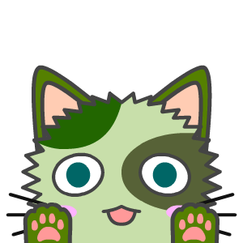

# About
wachabiです。
webデザイナー（駆け出し）です。

## Profile
- wachabi
- Niigata
- HTML/CSSを用いたweb開発を行っています。

# Skills
- GitHub Pages
- markdown
- HTML5
- CSS3
- JavaScript
- PHP

# Works
アピールできる活動内容を書きましょう。
- [GitHub](https://github.com/wachabi)
- [Qiita](QiitaのURL)
- 作った作品
  - [作品1](作品1のURL)
  - [作品2](作品2のURL)

# Contact
連絡先を書きましょう。
- [Twitter](TwitterプロフィールのURL)
- [LinkedIn](LinkedInプロフィールのURL)
- shou.nemuru8@gmail.com

# History
- 2015年　N予備校入学
- 2018年　某地方大学入学

<iframe width="560" height="315" src="https://www.youtube.com/embed/5HOIwyth3zE" frameborder="0" allow="accelerometer; autoplay; encrypted-media; gyroscope; picture-in-picture" allowfullscreen></iframe>
